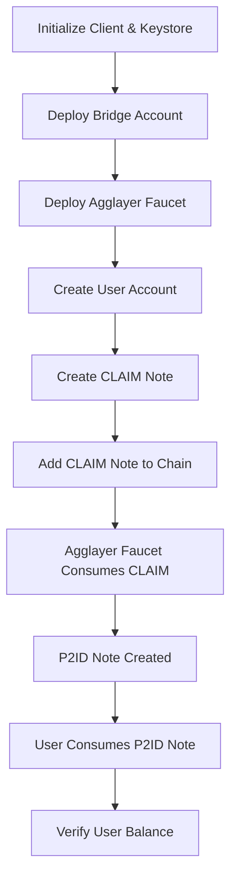

# Agglayer Bridge-In CLAIM Note Migration Plan

## Overview
This plan outlines the steps to update the miden-tutorials repository to use new versions of miden-base & miden-client, and implement a CLAIM note bridge-in test that replicates the test from miden-base (agglayer branch).

## Current State Analysis

### Dependencies (Cargo.toml)
Currently using:
- `miden-client` (tag: agglayer-v0.1)
- `miden-protocol` (tag: agglayer-v0.1) - formerly miden-objects
- `miden-standards` (tag: agglayer-v0.1) - formerly miden-lib
- `miden-agglayer` (tag: agglayer-v0.1)
- `miden-tx` (tag: agglayer-v0.1)

**Target version**: `exp-agglayer-v0.2` for all miden dependencies

### Import Changes Required
- `miden_objects` → `miden_protocol`
- `miden_lib` → `miden_standards`

### Files Requiring Updates
1. [`rust-client/src/bin/network_notes_counter_contract.rs`](rust-client/src/bin/network_notes_counter_contract.rs:22)
   - Line 22: `use miden_objects::` → `use miden_protocol::`
   - Line 20: `use miden_lib::` → `use miden_standards::`

2. [`rust-client/src/bin/create_mint_consume_send.rs`](rust-client/src/bin/create_mint_consume_send.rs:21)
   - Line 21: `use miden_objects::` → `use miden_protocol::`
   - Line 1: `use miden_lib::` → `use miden_standards::`

## Implementation Plan

### Phase 1: Dependency Updates

#### Step 1: Update Cargo.toml
Update all miden dependencies to use `exp-agglayer-v0.2` tag:
- `miden-client` → tag: exp-agglayer-v0.2
- `miden-client-sqlite-store` → tag: exp-agglayer-v0.2
- `miden-protocol` → tag: exp-agglayer-v0.2
- `miden-standards` → tag: exp-agglayer-v0.2
- `miden-agglayer` → tag: exp-agglayer-v0.2 (with testing features)
- `miden-tx` → tag: exp-agglayer-v0.2
- Add `anyhow` dependency for error handling (used in reference test)

#### Step 2: Update Import Statements
Replace all occurrences:
- `miden_objects` → `miden_protocol`
- `miden_lib` → `miden_standards`

### Phase 2: Create CLAIM Note Bridge-In Test

#### File Structure
Create new file: `rust-client/src/bin/agglayer_bridge_in_test.rs`

#### Test Flow Architecture



#### Component Details

##### 1. Bridge Account
```rust
use miden_agglayer::create_existing_bridge_account;

// Generate seed using client RNG
let bridge_seed = client.rng().draw_word();
let bridge_account = create_existing_bridge_account(bridge_seed);
client.add_account(&bridge_account, false).await?;
```

**Purpose**: Validates MMR (Merkle Mountain Range) for bridge operations

##### 2. Agglayer Faucet Account
```rust
use miden_agglayer::create_existing_agglayer_faucet;

let token_symbol = "AGG";
let decimals = 8u8;
let max_supply = Felt::new(1000000);
let agglayer_faucet_seed = client.rng().draw_word();

let agglayer_faucet = create_existing_agglayer_faucet(
    agglayer_faucet_seed,
    token_symbol,
    decimals,
    max_supply,
    bridge_account.id(),
);
client.add_account(&agglayer_faucet, false).await?;
```

**Purpose**: Mints fungible tokens when consuming CLAIM notes

##### 3. User Account
```rust
use miden_protocol::account::{Account, AccountBuilder};
use miden_standards::account::wallets::BasicWallet;

let user_account_builder = Account::builder(client.rng().random())
    .with_component(BasicWallet);

// Add to client
client.add_account(&user_account, false).await?;
```

**Purpose**: Receives P2ID note with minted tokens

##### 4. CLAIM Note Creation
```rust
use miden_agglayer::{
    ClaimNoteInputs,
    EthAddressFormat,
    EthAmount,
    LeafData,
    OutputNoteData,
    ProofData,
    create_claim_note,
};
use miden_agglayer::test_utils::claim_note_test_inputs;

// Get test inputs from miden_agglayer
let (
    smt_proof_local_exit_root,
    smt_proof_rollup_exit_root,
    global_index,
    mainnet_exit_root,
    rollup_exit_root,
    origin_network,
    origin_token_address,
    destination_network,
    metadata,
) = claim_note_test_inputs();

// Convert to required types
let destination_address = EthAddressFormat::from_account_id(user_account.id()).into_bytes();
let serial_num = client.rng().draw_word();
let amount_eth = EthAmount::from_u32(claim_amount);

// Build ProofData
let local_proof_array: [SmtNode; 32] = /* convert Vec to array */;
let rollup_proof_array: [SmtNode; 32] = /* convert Vec to array */;

let proof_data = ProofData {
    smt_proof_local_exit_root: local_proof_array,
    smt_proof_rollup_exit_root: rollup_proof_array,
    global_index,
    mainnet_exit_root: ExitRoot::from(mainnet_exit_root),
    rollup_exit_root: ExitRoot::from(rollup_exit_root),
};

// Build LeafData
let leaf_data = LeafData {
    origin_network,
    origin_token_address: EthAddressFormat::new(origin_token_address),
    destination_network,
    destination_address: EthAddressFormat::new(destination_address),
    amount: amount_eth,
    metadata,
};

// Build OutputNoteData
let output_note_data = OutputNoteData {
    output_p2id_serial_num: serial_num,
    target_faucet_account_id: agglayer_faucet.id(),
    output_note_tag: NoteTag::with_account_target(user_account.id()),
};

// Create CLAIM note
let claim_inputs = ClaimNoteInputs { proof_data, leaf_data, output_note_data };
let claim_note = create_claim_note(claim_inputs, user_account.id(), client.rng())?;
```

##### 5. P2ID Note Creation (Expected Output)
```rust
use miden_standards::note::WellKnownNote;

let p2id_script = WellKnownNote::P2ID.script();
let p2id_inputs = vec![user_account.id().suffix(), user_account.id().prefix().as_felt()];
let note_inputs = NoteInputs::new(p2id_inputs)?;
let p2id_recipient = NoteRecipient::new(serial_num, p2id_script.clone(), note_inputs);

let mint_asset: Asset = FungibleAsset::new(agglayer_faucet.id(), amount_felt.into())?.into();
let output_note_tag = NoteTag::with_account_target(user_account.id());

let expected_p2id_note = Note::new(
    NoteAssets::new(vec![mint_asset])?,
    NoteMetadata::new(agglayer_faucet.id(), NoteType::Public, output_note_tag),
    p2id_recipient,
);
```

##### 6. Transaction Execution - Faucet Consumes CLAIM
```rust
// Build transaction context with foreign account inputs
let foreign_account_inputs = client.get_foreign_account_inputs(bridge_account.id())?;

let tx_context = client
    .build_tx_context(agglayer_faucet.id(), &[], &[claim_note])?
    .add_note_script(p2id_script.clone())
    .foreign_accounts(vec![foreign_account_inputs])
    .build()?;

let executed_transaction = tx_context.execute().await?;
```

**Key Points**:
- Foreign account inputs needed for bridge MMR validation
- Note script must be added to transaction context
- CLAIM note is consumed as input note

##### 7. Verification
```rust
// Verify P2ID note was created
assert_eq!(executed_transaction.output_notes().num_notes(), 1);
let output_note = executed_transaction.output_notes().get_note(0);

// Verify metadata
assert_eq!(output_note.metadata().sender(), agglayer_faucet.id());
assert_eq!(output_note.metadata().note_type(), NoteType::Public);
assert_eq!(output_note.id(), expected_p2id_note.id());

// Verify asset content
let full_note = match output_note {
    OutputNote::Full(note) => note,
    _ => panic!("Expected OutputNote::Full variant"),
};

assert_eq!(full_note, &expected_p2id_note);
```

##### 8. User Consumes P2ID Note
```rust
// Submit to chain first
client.add_pending_executed_transaction(&executed_transaction)?;
client.sync_state().await?;

// Consume with user account
let mut user_account_mut = user_account.clone();
let consume_tx_context = client
    .build_tx_context(user_account_mut.clone(), &[], &[expected_p2id_note])?
    .build()?;

let consume_executed_transaction = consume_tx_context.execute().await?;

// Apply delta
user_account_mut.apply_delta(consume_executed_transaction.account_delta())?;

// Verify balance
let balance = user_account_mut.vault().get_balance(agglayer_faucet.id())?;
assert_eq!(balance, expected_asset.amount());
```

### Phase 3: Network vs Local Transaction Handling

#### Network Account Consideration
The reference test uses `MockChain` which handles network accounts differently than the client. For the client-based implementation:

**Option 1: Network Accounts (Preferred if supported)**
- Deploy bridge and faucet as network accounts
- Use network transaction builder
- Follow pattern from [`network_notes_counter_contract.rs`](rust-client/src/bin/network_notes_counter_contract.rs:155)

**Option 2: Local Simulation (Fallback)**
- Deploy as public accounts instead of network
- Execute transactions locally
- Still validates the CLAIM → P2ID flow

### Phase 4: Configuration

#### Endpoint Configuration
```rust
let endpoint = Endpoint::localhost();
let timeout_ms = 10_000;
let rpc_client = Arc::new(GrpcClient::new(&endpoint, timeout_ms));
```

#### Client Setup
```rust
let keystore_path = std::path::PathBuf::from("./keystore_agglayer");
let keystore = Arc::new(FilesystemKeyStore::<StdRng>::new(keystore_path)?);

let store_path = std::path::PathBuf::from("./store_agglayer.sqlite3");

let mut client = ClientBuilder::new()
    .rpc(rpc_client)
    .sqlite_store(store_path)
    .authenticator(keystore.clone())
    .in_debug_mode(true.into())
    .build()
    .await?;
```

## Key Differences: MockChain vs Client

| Aspect | MockChain (Reference Test) | Client (Our Implementation) |
|--------|---------------------------|----------------------------|
| Account Addition | `builder.add_account()` | `client.add_account().await?` |
| Transaction Building | `mock_chain.build_tx_context()` | `client.build_tx_context()` |
| Execution | `tx_context.execute().await?` | `tx_context.execute().await?` |
| State Updates | `mock_chain.prove_next_block()?` | `client.sync_state().await?` |
| Foreign Accounts | `mock_chain.get_foreign_account_inputs()` | May need manual construction |
| Network Accounts | Automatic support | Depends on node configuration |

## Testing Strategy

### Prerequisites
1. Local Miden node running on localhost
2. Node configured to support agglayer features
3. Clean keystore and database for test isolation

### Test Execution Steps
1. Run local node: `miden-node start`
2. Execute test: `cargo run --bin agglayer_bridge_in_test`
3. Verify output shows:
   - Bridge account deployed
   - Agglayer faucet deployed
   - User account created
   - CLAIM note created
   - P2ID note minted
   - User balance updated

### Expected Output
```
Latest block: X
[STEP 1] Creating bridge account...
Bridge account ID: 0x...
[STEP 2] Creating agglayer faucet...
Faucet account ID: 0x...
[STEP 3] Creating user account...
User account ID: 0x...
[STEP 4] Creating CLAIM note...
CLAIM note ID: 0x...
[STEP 5] Agglayer faucet consuming CLAIM note...
Transaction ID: 0x...
P2ID note created: 0x...
[STEP 6] User consuming P2ID note...
Transaction ID: 0x...
✅ User balance: 100 AGG tokens
```

## Potential Challenges & Solutions

### Challenge 1: test_utils Feature
**Issue**: `miden_agglayer::test_utils` may not be exported in published crate
**Solution**: Ensure Cargo.toml includes testing features or copy test data generation

### Challenge 2: Foreign Account Inputs
**Issue**: Client may not have `get_foreign_account_inputs()` method
**Solution**: Manually construct foreign account data or use alternative approach

### Challenge 3: Network Account Support
**Issue**: Localhost node may not support network accounts
**Solution**: Fall back to public accounts with local transactions

### Challenge 4: Account Builder API Differences
**Issue**: `Account::builder()` syntax may differ from `AccountBuilder::new()`
**Solution**: Use correct API based on miden_protocol version

## Migration Checklist

- [ ] Update Cargo.toml dependencies
- [ ] Update imports in network_notes_counter_contract.rs
- [ ] Update imports in create_mint_consume_send.rs
- [ ] Create agglayer_bridge_in_test.rs
- [ ] Implement client initialization
- [ ] Implement bridge account deployment
- [ ] Implement agglayer faucet deployment
- [ ] Implement user account creation
- [ ] Implement CLAIM note creation
- [ ] Implement P2ID note creation
- [ ] Implement faucet transaction execution
- [ ] Implement user consumption transaction
- [ ] Add verification assertions
- [ ] Test with localhost node
- [ ] Document any API differences found
- [ ] Update README with new test instructions

## Success Criteria

1. All existing tests continue to pass with updated imports
2. New agglayer_bridge_in_test successfully:
   - Deploys all required accounts
   - Creates valid CLAIM note
   - Faucet consumes CLAIM and mints P2ID
   - User consumes P2ID and receives tokens
3. Test runs against localhost node without errors
4. Code follows existing patterns in the repository

## Next Steps

After plan approval:
1. Switch to Code mode to implement changes
2. Start with dependency updates
3. Update existing files
4. Create new test file
5. Test and iterate
